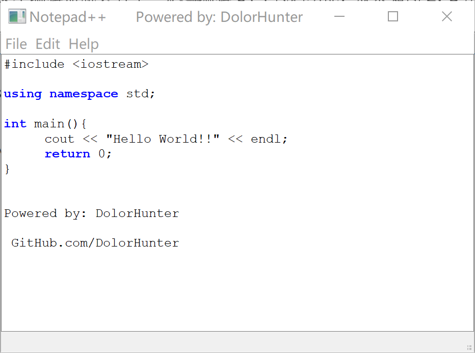

# Notepad

`本项目为数据结构课程设计大作业`

Qt: C++ Notepad

效果图:

Thanks to the tutorial from Derek Banas 

[Vedio Tutorial](https://www.youtube.com/watch?v=I96uPDifZ1w)

----------------------------------------------------------------

# BloomFilter Notepad

Using BloomFilter to highlight key words

[项目地址](https://github.com/DolorHunter/BloomFilter)

`本项目为数据结构课程设计作业`

$ Release版本的Notepad2.0可以直接下载使用.

`如果需要添加关键字, 可以创建.txt文件并用类似于C.txt文件的格式(首行为标记行, 第二行起为关键字, 一个关键字一行(一个文件最多写入290个关键字)). 并修改bloomfilter.cpp中的importKeyWords()函数. 该函数有标记为关键字添加函数, 应该不是很难找, 用相同的格式import即可, import前需要refresh().`

## 目录:

  ___[项目介绍](#布隆过滤器的实现和应用（90分）)___
  
  ___[血泪开发进度记录](#血泪开发进度记录)___

# 布隆过滤器的实现和应用（90分）

（1）问题描述
布隆过滤器是由巴顿.布隆于一九七零年提出的。它实际上是一个很长的二进制向量和一系列随机映射函数。假定需要存储一亿个电子邮件地址，首先建立一个十六亿二进制（比特），即两亿字节的向量，然后将这十六亿个二进制全部设置为零。对于每一个电子邮件地址X，可以用八个不同的散列函数（H1,H2,...,H8）产生八个从1到十六亿之间中的八个自然数g1,g2,...,g8。然后将这八个自然数对应的八个位置的二进制全部设置为一。同样的方法对这一亿个email地址都进行处理后，一个针对这些email地址的布隆过滤器就建成了。

如图所示：
 
现在看看如何用布隆过滤器来实现一个电子邮件地址过滤器，首先将那些放在黑名单上的电子邮件地址放在布隆过滤器中。当检测一个可疑的电子邮件地址Y是否在黑名单中，仍用相同的八个随机数产生器（H1,H2,...,H8）对这个邮件地址产生八个自然数s1,s2,...,s8，这八个自然数对应的八个二进制位分别是t1,t2,...,t8。如果Y在黑名单中，显然，t1,t2,..,t8对应的八个二进制一定是一。这样在遇到任何在黑名单中的电子邮件地址，都能准确地发现。
布隆过滤器决不会漏掉任何一个在黑名单中的可疑地址。但是，它有一条不足之处。也就是它有极小的可能将一个不在黑名单中的电子邮件地址判定为在黑名单中，因为有可能某个好的邮件地址正巧对应个八个都被设置成一的二进制位。但这种可能性很小，此处将它称为误识概率。在上面的例子中，误识概率在万分之一以下。
因此布隆过滤器的好处在于快速，省空间。但是有一定的误识别率。常见的补救办法是在建立一个小的白名单，存储那些可能别误判的邮件地址。

（2）课程设计目的

学习BloomFilter结构，能应用该结构解决一些实际问题。

（3）基本要求

①定义BloomFilter结构的ADT，该ADT应支持在BloomFilter中加入一个新的数据，查询数据是否在此过滤器中，并完成该结构的设计和实现。

②应用BloomFilter结构拼写检查，许多人都对Word的拼写检查功能非常了解，当用户拼错一个单词的时候，Word会自动将这个单词用红线标注出来。Word的具体工作原理不得而知，但另一个拼写检查器UNIXspell-checkers这个软件中就用到了BloomFilter。UNIXspell-checkers将所有的字典单词存成BloomFilter数据结构，而后直接在BloomFilter上进行查询。本课程设计要求针对C语言设计和实现上述拼写检查器，即当写了一个正确的关键词，如int时，给该词标上颜色，如蓝色。

③针对上述C语言关键词拼写检查器进行分析，如错误分析，设计散列函数个数分析，运行时间复杂性、空间复杂性的分析。

④上述C语言关键词拼写检查器最好是在VC++或Java等可视化开发环境下实现。

⑤上述C语言关键词拼写检查器最好能支持所有的C++关键词。

（4）实现提示

BloomFilter结构中的散列函数（包括散列函数的个数和散列函数的设计）是本题目中需要深入思考的一个环节。

# 血泪开发进度记录

2019. 02. 19 00:??
- [x] 读取并导入关键字表

- [ ] Hash func
- [ ] create Filter
- [ ] Qt
---------------------------------------
2019.02.19 23:04 第三日
- [x] 读取并导入关键字表
- [x] Hash func
- [x] create Filter

- [ ] 单词判断
- [ ] Qt
--------------------------------------------
2019.02.20 23:10 第四日
- [x] 读取并导入关键字表
- [x] Hash func
- [x] create Filter
- [x] 安装Qt5.11

- [ ] 单词判断
- [ ] Qt
------------------------------------------
2019.02.21 22:10 第五日 
- [x] 读取并导入关键字表
- [x] Hash func
- [x] create Filter
- [x] 安装Qt5.11
- [x] Qt
- [x] Notepad

- [ ] 单词判断 关键词标记
- [ ] 收尾调试
------------------------------------------
2019.02.27 16:59 第11日 
- [x] 读取并导入关键字表
- [x] Hash func
- [x] create Filter
- [x] 安装Qt5.11
- [x] Qt
- [x] Notepad
- [x] 单词判断 关键词标记
- [x] 收尾调试
- [x] 过滤器正常 & 判断器正常

- [ ]为什么就是不会变色呢????
------------------------------------------

一整周时间:

查找各种文档, 各种改算法, 最后发现不是算法的问题, 是没有调用到.
这个环节是最血泪的, 一度认为项目要流产.

------------------------------------------
2019.03.07 19:47 第??日

当项目被改的面目全非的时候, 一个意外让我发现了mainwindow.cpp中少了这个

setCentralWidget(editor);

项目完成

吐血...
